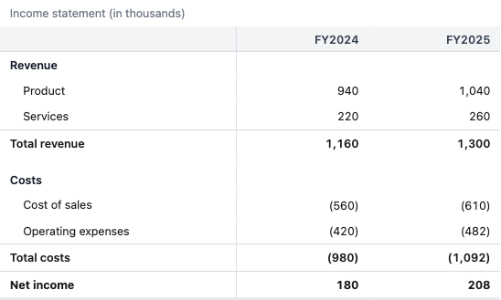
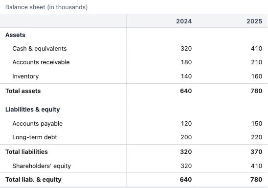
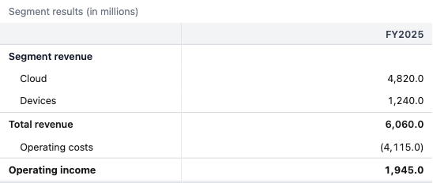
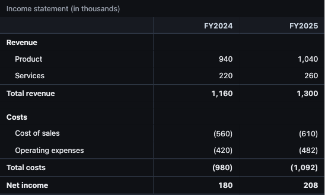
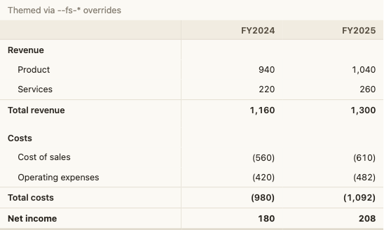
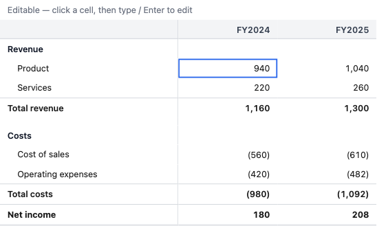
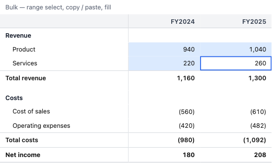

# Gallery

Screenshots of `<Grid>` across representative configs — statement shapes, themes, editing, and
formatting. These are **documentation** images (curated, brand-neutral); they are **not** a
visual-regression gate.

Regenerate them all with:

```sh
pnpm screenshots
```

That renders each config in real Chromium (via Playwright — the same stack as `pnpm test:browser`)
and writes one PNG per shot into `docs/screenshots/`. The fixtures live in
[`screenshots/gallery.screenshots.test.tsx`](../screenshots/gallery.screenshots.test.tsx). Exact
pixels vary a little by machine (system fonts), which is why these aren't diffed in CI.

## Statements

A read-only income statement — sticky header, sticky label column, right-aligned `tabular-nums`,
negatives in parentheses, a subtotal underline, and the grand-total double rule.



A balance sheet — a different structure (assets / liabilities & equity), with the trailing `total`
pinned to the sticky footer.



Segment results shown **in millions** (`defaultFormat={{ scale: "millions", precision: 1 }}`) — the
raw values are stored in full units; the grid scales them for display.



## Themes

Dark theme (`theme="dark"`) — light is the default and dark follows the OS unless the `theme` prop
forces it.



Any look is reachable by overriding the flat `--fs-*` custom properties — here a warm "paper"
palette. finsheet ships **brand-neutral**; the host themes it.



## Editing

`mode="edit"` — click or arrow to a cell for the keyboard-focus ring, then type / Enter to edit.
Only `line` cells in numeric, unlocked columns are reachable.



`mode="bulk"` — extend a rectangular selection (shift-arrow, shift-click, or drag) for
copy / paste / fill. The band tints editable cells; the focus corner keeps its outline.


